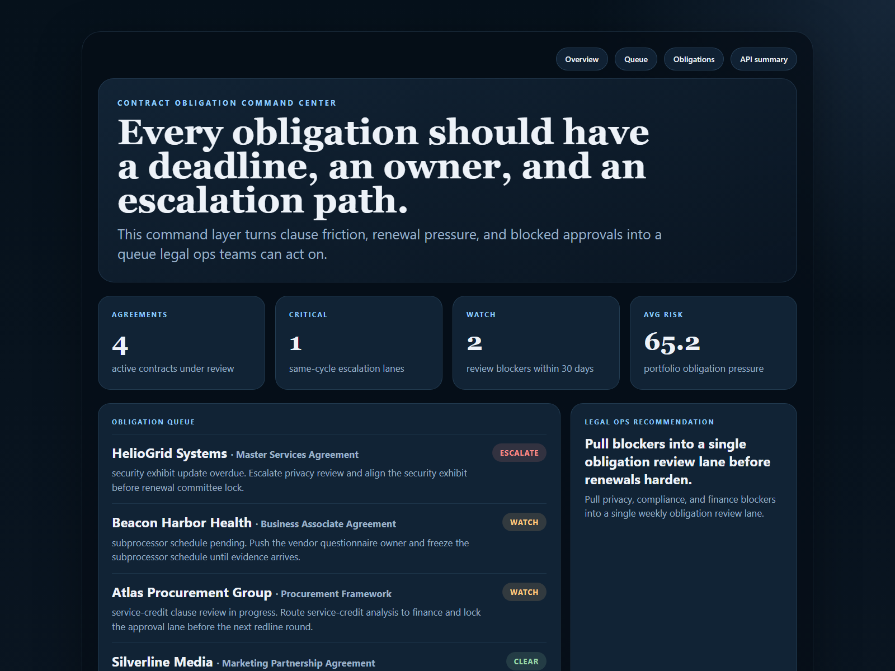
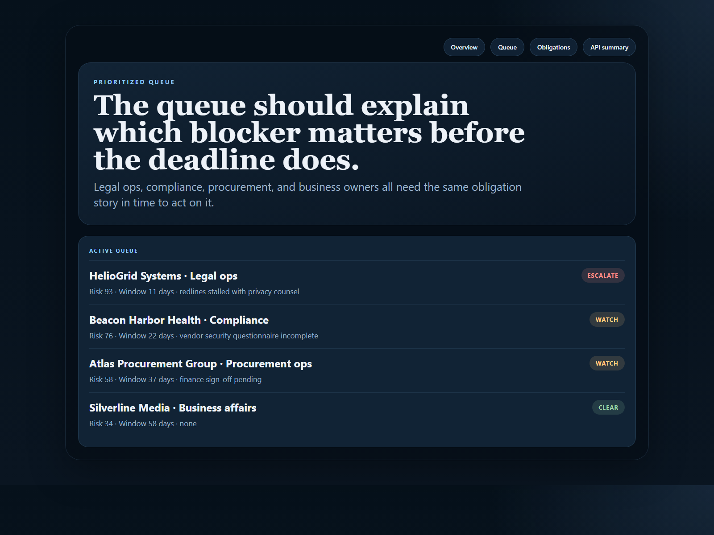
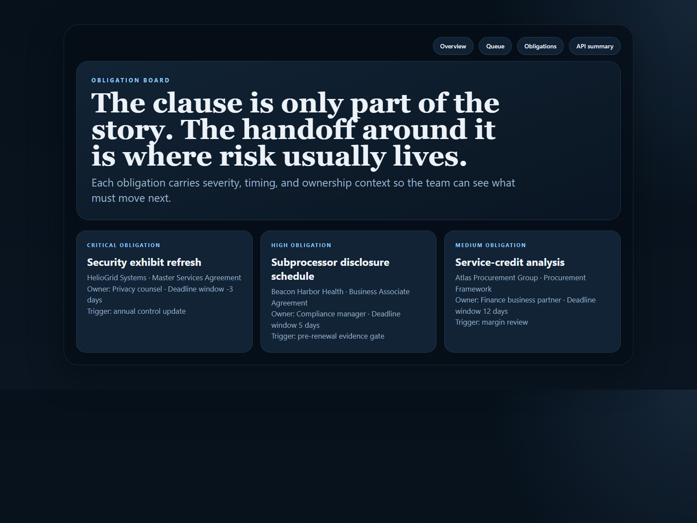
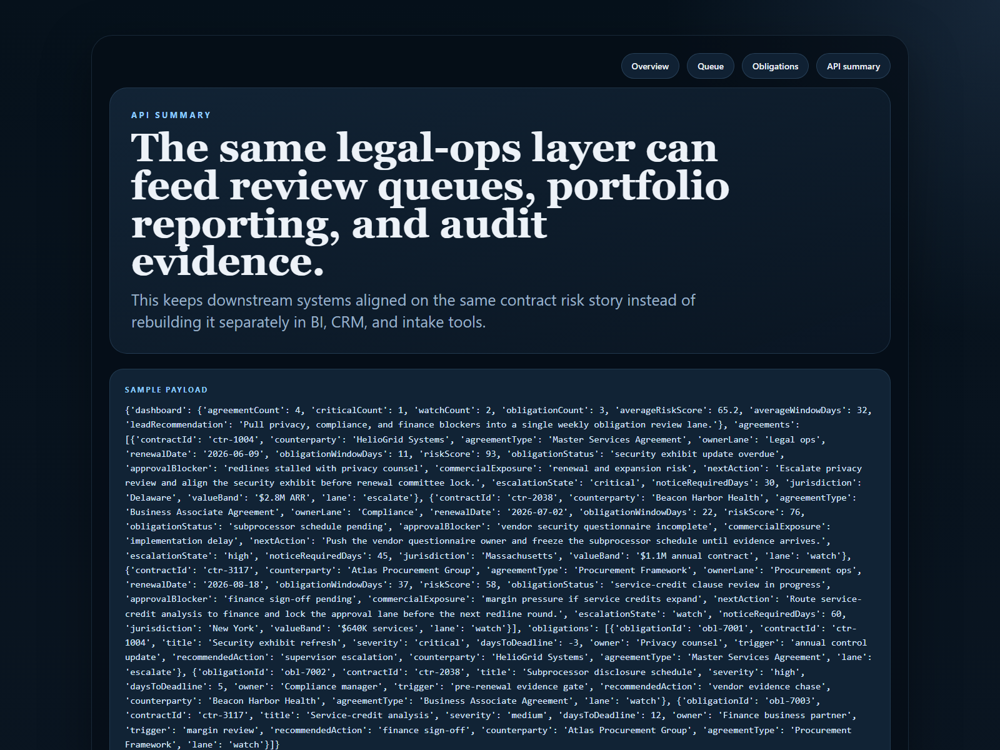

# Contract Obligation Command Center

Operational command center for contract obligations, milestone risk, and cross-owner escalation.

## Why it matters

Enterprise contracts rarely go off track because nobody noticed the clause. They go off track because ownership is fragmented, deadlines drift, renewals tighten, and approval blockers stay hidden too long. This repo models a legal-ops control layer that makes those risks visible early enough to act on them.

## What it does

- Scores agreements by obligation pressure, renewal timing, and approval friction
- Prioritizes a legal-ops queue across critical, watch, and clear lanes
- Tracks obligations with severity, deadlines, owners, and recommended response
- Publishes human-readable proof surfaces and API-friendly outputs from the same service layer

## Proof









## Local run

```powershell
cd contract-obligation-command-center
py -3.11 -m venv .venv
.\.venv\Scripts\pip.exe install -r requirements.txt
.\.venv\Scripts\python.exe -m app.main
```

Open:

- `http://127.0.0.1:4904/`
- `http://127.0.0.1:4904/queue`
- `http://127.0.0.1:4904/obligations`
- `http://127.0.0.1:4904/docs`

## Validation

```powershell
.\.venv\Scripts\python.exe -m unittest discover -s tests
.\.venv\Scripts\python.exe scripts\run_demo.py
.\.venv\Scripts\python.exe scripts\smoke_check.py
.\.venv\Scripts\python.exe scripts\render_readme_assets.py
```

## Repo layout

- `app/main.py` FastAPI routes and local runtime entrypoint
- `app/services/contract_service.py` contract scoring and sample payload logic
- `app/data/sample_contracts.json` sample agreement and obligation data
- `app/render.py` README proof surface generation
- `docs/architecture.md` system framing and data flow
